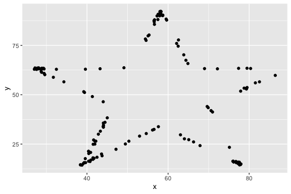
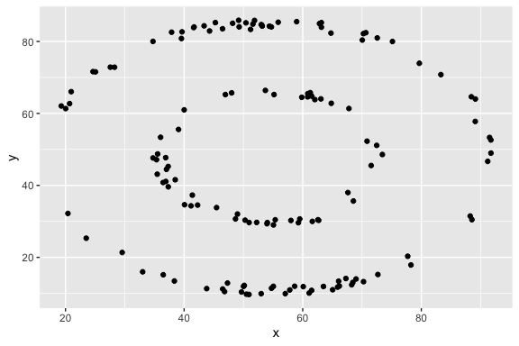

Lab 01 - Hello R
================
Zi Li
1/22

# Load packages and data

``` r
#install.packages("tidyverse")
#install.packages("datasauRus")
library(tidyverse) 
library(datasauRus)
```

## Exercises

### Exercise 1

``` r
datasaurus_dozen %>%
  count(dataset) %>%
  print(13)
```

    ## # A tibble:
    ## #   13 × 2
    ##    dataset   
    ##    <chr>     
    ##  1 away      
    ##  2 bullseye  
    ##  3 circle    
    ##  4 dino      
    ##  5 dots      
    ##  6 h_lines   
    ##  7 high_lines
    ##  8 slant_down
    ##  9 slant_up  
    ## 10 star      
    ## 11 v_lines   
    ## 12 wide_lines
    ## 13 x_shape   
    ## # ℹ 1 more
    ## #   variable:
    ## #   n <int>

# answer for Ex 1: we have 13 rows and 2 columns. we have these variables: away, bullseye, circle, dino, dots, h_lines, high_lines, slant_down, slant_up, star, v_lines, wide_lines, x_shape.

### Exercise 2

# First, let’s plot the data in the dino dataset:

``` r
dino_data <- datasaurus_dozen %>%
  filter(dataset == "dino")

ggplot(data = dino_data, mapping = aes(x = x, y = y)) +
  geom_point()
```

<!-- -->

# calculate the correlation between `x` and `y` in this dataset:

``` r
dino_data %>%
  summarize(r = cor(x, y))
```

    ## # A tibble: 1 × 1
    ##         r
    ##     <dbl>
    ## 1 -0.0645

Once you’ve cleaned up the text, add your own explanation or
observations here! \# answer for Ex.2: we filter the dataset “dino” and
plot it out, it’s a dinosaurs. and we run the correlation anaysis
between our X-asix and Y-asix, it’s -0.06, not a super strong negative
correlation.

### Exercise 3

``` r
star_data <- datasaurus_dozen %>%
  filter(dataset == "star")

ggplot(data = star_data, mapping = aes(x = x, y = y)) +
  geom_point()
```

<!-- -->

``` r
dino_data %>%
  summarize(r = cor(x, y))
```

    ## # A tibble: 1 × 1
    ##         r
    ##     <dbl>
    ## 1 -0.0645

# the r=-0.06, not a strong correlation tho.

# explanation: the correaltion here is the same, which make sense, cause it’s the same dataset, we just plot it into different shape.

### Exercise 4

``` r
circle_data <- datasaurus_dozen %>%
  filter(dataset == "circle")

ggplot(data = circle_data, mapping = aes(x = x, y = y)) +
  geom_point()
```

<!-- -->

``` r
circle_data %>%
  summarize(r = cor(x, y))
```

    ## # A tibble: 1 × 1
    ##         r
    ##     <dbl>
    ## 1 -0.0683

# compare with Ex 3. the r for Ex. 4 increase a bit, now it’s -0.068, still not a strong correlation.

# I’d like to change my explanation I made for Ex.3, they are not the same dataset, the command “filter” already select the data form the whole dataset.

### Exercise 5

``` r
ggplot(datasaurus_dozen, aes(x = x, y = y, color = dataset)) +
  geom_point() +
  facet_wrap(~dataset, ncol = 3) +
  theme(legend.position = "none")
```

<!-- -->

``` r
datasaurus_dozen %>%
  group_by(dataset) %>%
  summarize(r = cor(x, y)) %>%
  print(13)
```

    ## # A tibble:
    ## #   13 × 2
    ##    dataset   
    ##    <chr>     
    ##  1 away      
    ##  2 bullseye  
    ##  3 circle    
    ##  4 dino      
    ##  5 dots      
    ##  6 h_lines   
    ##  7 high_lines
    ##  8 slant_down
    ##  9 slant_up  
    ## 10 star      
    ## 11 v_lines   
    ## 12 wide_lines
    ## 13 x_shape   
    ## # ℹ 1 more
    ## #   variable:
    ## #   r <dbl>

# I’m just playing around ⬇️

``` r
bullseye_data <- datasaurus_dozen %>%
  filter(dataset == "bullseye")

ggplot(data = bullseye_data, mapping = aes(x = x, y = y)) +
  geom_point()
```

<!-- -->

``` r
bullseye_data %>%
  summarize(r = cor(x, y))
```

    ## # A tibble: 1 × 1
    ##         r
    ##     <dbl>
    ## 1 -0.0686
